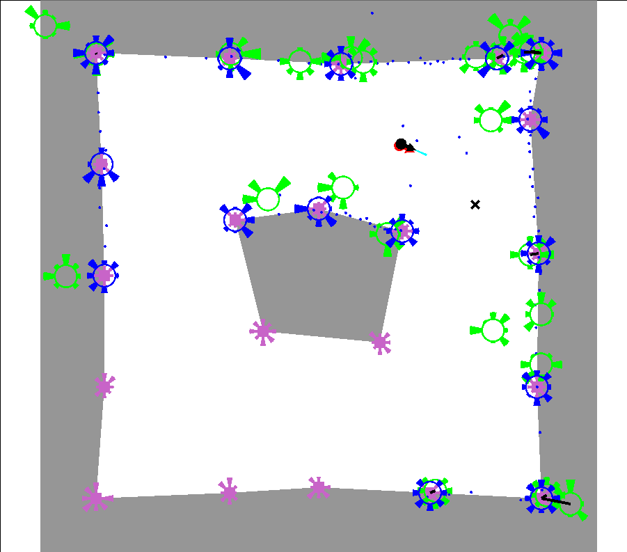

# Localisation for mobile robotics

To become more familiar with the fundamentals of localisation in mobile robotics, I'm creating this repository to implement various algorithms.  
I'm following the probabilistic robotics textbook by Sebastian Thrun, and intend to implement many of the algorithms outlined here, focusing on those that are more widely used such as gaussian localisation methods, monte-carlo localisation and feature-based graph-slam.

I may also implement navigation methods afterwards.

This project is focused on learning, so keeps everything else as simple as possible. That means:
- Only implemented for a 2D simulated environment
- Only simulates a simple range sensor (although you can specify any measurement model)
- Allows faking the feature detection process by adding noise to specified landmark locations (although I may expore feature detection methods for range sensors at a later stage)
- No dynamics. Assumes the target velocity can be achieved (with adjustable noise).
- Simple rendering using SFML.
- Minimal consideration to efficiency. Getting certain algorithms to be performed efficienty is another challenge, and isn't much of a concern when dealing with the simple data used here.

Additionally, I want to be able to step through each step of an algorithm, to see what changes occur each step, and be able to visualise relevant information.

## Localisation with a known map

### EKF localisation

- For EKF localisation, a map is provided with known landmark locations.
- Uses a gaussian feature model to provide updates to the extended kalman filter, as well as using a motion model for the predict steps.  
- Blue markers indicate the expected feature locations (given knowledge of what features should be observable)
- Green markers indicate the the observed feature locations. For both these markers, the radial segments show the feature descriptors.
- Lines are shown between feature correspondances. These use a maximum-likelihood feature matcher, and ignore features where the best likelihood is below a threshold.
- In this particular case, the feature model used to model the feature generation process is particularly noisy, with lots of false positive and negatives, but still maintains a reasonable state estimate.  
- However, it requires knowledge of the initial pose, cannot handle kidnapping, and assumes reasonable feature detection is possible.

